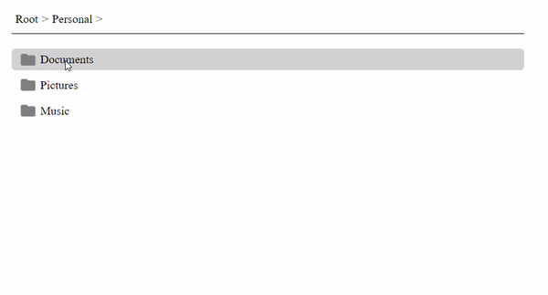

# Breadcrumbs Component

This project implements a reusable `Breadcrumbs` component in React that allows users to implement a list of links that help visualize a page's location within a site's hierarchical structure, allowing navigation up to any of the ancestors.

## Preview



## Usage

Here's how to use the `Breadcrumbs` and `Crumb` components in your project:

```tsx
import React, { useState } from "react";
import { Breadcrumbs, Crumb } from "./Breadcrumbs";

const App = () => {
  const [breadcrumbList, setBreadcrumbList] = useState([]);

  const openFolder = (id) => {
    // Define your folder opening logic here
  };

  return (
    <Breadcrumbs>
      {breadcrumbList.map((folder) => (
        <Crumb key={folder.id} clickHandler={() => openFolder(folder.id)}>
          {folder.name}
        </Crumb>
      ))}
    </Breadcrumbs>
  );
};

export default App;
```

## Props

### `Crumb`

The Crumb component represents an individual breadcrumb item.

```typescript
export type CrumbProps = {
  clickHandler: () => void;
  children: string;
};
```

- `clickHandler`: A function to be called when the breadcrumb item is clicked.
- `children`: The name of the breadcrumb item (string).

### `Breadcrumbs`

The Breadcrumbs component wraps around multiple `Crumb` components.

```typescript
export type BreadcrumbProps = {
  children: JSX.Element[];
};
```

- `children`: An array of `Crumb` components.

## Installation

- Pull this branch into your local system.
- Make sure you have Node installed (preferrably Node v20.11.1).
- Navigate to the project directory and run
  ```
  npm install
  ```
- Once all the dependencies have been installed, run the following command to start the dev server.
  ```
  npm run dev
  ```
